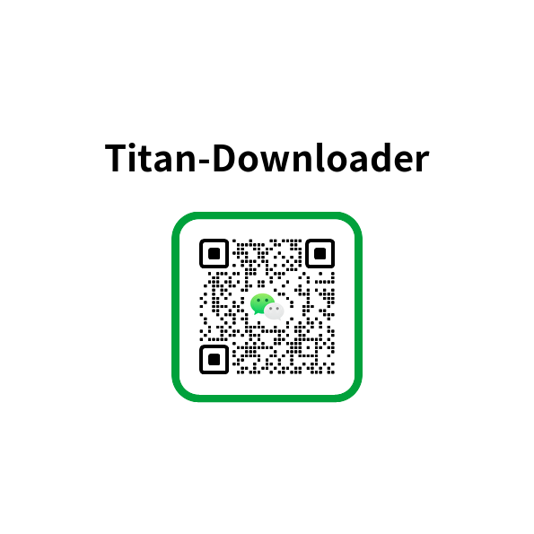

# 泰坦下载器 (Titan Downloader)

[**English**](https://github.com/dhs964057117/Titan-Downloader/blob/main/README.md) | **中文**

[](https://opensource.org/licenses/Apache-2.0)
[](https://www.android.com)
[](https://kotlinlang.org)
[](https://jitpack.io/v/dhs964057117/Titan-Downloader.svg)
一个为 Android 平台设计的高性能、高可用、无侵入的下载框架。其设计思想受 OkHttp Dispatcher
启发，为高并发、高效率和出色的扩展性而构建。

 

---

## ✨ 功能特性

* **高性能与高并发**: 通过内存中的调度中心（Dispatcher）管理下载任务，最大限度地减少数据库
  I/O，并支持多任务并发下载。
* **强大的后台执行**: 基于 `WorkManager` 构建，确保即使应用关闭或设备重启，下载任务也能稳定地继续执行。
* **完整的生命周期管理**: 支持对单个或多个任务进行暂停、恢复和取消操作。
* **断点续传**: 所有下载都支持从中断点恢复下载，节省流量和时间。
* **智能文件名决议**: 可自动从 `Content-Disposition` 响应头、URL 路径或 MIME
  类型中解析文件名，并以降级到时间戳的方式确保有效。
* **自动处理冲突**: 下载同名文件时，可自动在文件名后添加 `(1)`, `(2)` 等后缀，防止文件覆盖。
* **丰富的交互式通知**: 可显示实时进度、速度和状态，并提供暂停、恢复和取消的操作按钮。
* **适配现代 Android**: 完美适配现代 Android 版本，包括分区存储（Scoped Storage，使用 `MediaStore`
  ）和前台服务要求。
* **轻量无侵入**: 零第三方 DI 框架依赖（无 Hilt, Koin）。集成简单，不污染宿主应用的架构。
* **高度可扩展**: 下载逻辑采用策略模式（Strategy Pattern），未来可轻松扩展对其他协议（如 HLS, FTP）的支持。
* **可定制化**: 提供灵活的 `Builder` 模式，用于配置最大并发数、最终保存目录等核心参数。

## 🚀 快速开始

### 1. 添加依赖

将此库添加到您模块的 `build.gradle.kts` (或 `build.gradle`) 文件中。
[](https://jitpack.io/v/dhs964057117/Titan-Downloader.svg)
```groovy
// Placeholder dependency
implementation 'com.github.dhs964057117:Titan-Downloader:1.0.0-beta01'
```
```kotlin
implementation("com.github.dhs964057117:Titan-Downloader:1.0.0-beta01")
```
2. 配置权限
   请确保在 AndroidManifest.xml 中声明了必要的权限。

```XML

<uses-permission android:name="android.permission.INTERNET" /><uses-permission
android:name="android.permission.POST_NOTIFICATIONS" />

<uses-permission android:name="android.permission.WRITE_EXTERNAL_STORAGE"
android:maxSdkVersion="28" />

<service android:name="androidx.work.impl.foreground.SystemForegroundService"
android:foregroundServiceType="dataSync" tools:node="merge" />
```

3. 在 Application 中初始化
   您必须在 Application 类中对下载器进行一次性初始化。这是非常关键的一步。

```Kotlin
class DownloadApplication : Application() {
    companion object {
        lateinit var context: Context
    }

    // 自定义的通知实现(可选)
    private val notificationProvider = object : INotificationProvider{
        override suspend fun createForegroundInfo(
            task: DownloadTaskEntity,
            notification: Notification,
        ): androidx.work.ForegroundInfo {
        }

        override fun createClickIntent(task: DownloadTaskEntity): PendingIntent? {
        }

        override suspend fun buildNotification(
            task: DownloadTaskEntity,
            clickIntent: PendingIntent?,
        ): NotificationCompat.Builder {
        }

        override suspend fun updateNotification(
            notificationId: Int,
            task: DownloadTaskEntity,
        ) {
        }

        override fun cancel(notificationId: Int) {
        }

        override fun show(
            notificationId: Int,
            builder: NotificationCompat.Builder,
        ) {
        }
    }
    override fun onCreate() {
        super.onCreate()
        context = this
        // 使用 Builder 创建配置
        val downloaderConfig = DownloaderConfig.Builder(this)
            .setFinalDirectory(Environment.getExternalStoragePublicDirectory(Environment.DIRECTORY_DOWNLOADS).absolutePath) // 现在支持传统file路径、MediaStore和SAF
            .setNotificationClickIntent(createActionIntent())
            .setMaxConcurrentDownloads(5)
            .setNotificationProvider(notificationProvider) //自定义通知实现
//            .setHttpClient()
            .setLogger(TimberLogger()) // 使用我们自己实现的 Logger
            .build()

        // 初始化 Downloader 单例
        DownloaderManager.initialize(this, downloaderConfig)
    }

    private fun createActionIntent(): PendingIntent {
        val intent = Intent(context, MainActivity::class.java)
        return PendingIntent.getActivity(
            context,
            10000,
            intent,
            PendingIntent.FLAG_UPDATE_CURRENT or PendingIntent.FLAG_IMMUTABLE
        )
    }
}

class TimberLogger : ILogger {
    override fun d(tag: String, message: String) {
        Log.d(tag, message)
    }

    override fun e(tag: String, message: String, throwable: Throwable?) {
        Log.e(tag, message, throwable)
    }
}
```

📚 API 用法
一旦初始化完成，您就可以在应用的任何地方通过 Downloader 对象来调用它。

添加下载任务

```Kotlin

// 在 ViewModel 或协程作用域中
viewModelScope.launch {
    // 添加单个任务
    val request1 = DownloadRequest(url = "...", fileName = "file1.zip")
    val singleTaskIds = Downloader.enqueue(request1)

    // 一次性添加多个任务
    val request2 = DownloadRequest(url = "...", fileName = "file2.jpg")
    val request3 = DownloadRequest(url = "...", fileName = "file3.pdf")
    val batchTaskIds = Downloader.enqueue(request2, request3) // 返回一个 List<Long>
}
```

控制任务
API 支持批量操作来控制任务。

```Kotlin

// 暂停一个或多个任务
Downloader.pause(taskId1, taskId2)

// 恢复一个或多个任务
Downloader.resume(taskId1, taskId2)

// 取消一个或多个任务
Downloader.cancel(taskId1, taskId2)
```

监听任务更新
实现 DownloadListener 接口并将其添加到下载器，以接收实时更新。

```Kotlin

import com.awesome.dhs.tools.downloader.DownloaderManager
import com.awesome.dhs.tools.downloader.interfac.DownloadListener
import com.awesome.dhs.tools.downloader.db.DownloadTaskEntity

class MyActivity : AppCompatActivity() {

    private val downloadListener = object : DownloadListener {
        override fun onTaskUpdated(task: DownloadTaskEntity) {
            // 在这里根据任务的状态和进度更新你的 UI
            Log.d(
                "Downloader",
                "Task Updated: ID=${task.id}, Status=${task.status}, Progress=${task.progress}%"
            )
        }
    }

    override fun onStart() {
        super.onStart()
        DownloaderManager.addListener(downloadListener)
    }

    override fun onStop() {
        super.onStop()
        // 重要：移除监听器以防止内存泄漏
        DownloaderManager.removeListener(downloadListener)
    }
}
```

🗺️ 路线图 (未来计划)
* **✅HLS 视频流下载:** 支持下载 HLS (m3u8) 视频流并合并为单个文件。

* **任务优先级:** 允许为下载任务设置优先级。

* **带宽限制:** 提供限制下载速度的选项。

* **高级重试策略:** 实现可配置的重试策略，例如指数退避。

* **支持更多协议:** 扩展策略模式以支持如 FTP 等协议。

📄 许可证
Copyright 2025 [你的名字或组织]

Licensed under the Apache License, Version 2.0 (the "License");
you may not use this file except in compliance with the License.
You may obtain a copy of the License at

    http://www.apache.org/licenses/LICENSE-2.0

Unless required by applicable law or agreed to in writing, software
distributed under the License is distributed on an "AS IS" BASIS,
WITHOUT WARRANTIES OR CONDITIONS OF ANY KIND, either express or implied.
See the License for the specific language governing permissions and
limitations under the License.

💬Community


## 🚀 支持一下我的App SnapSaver

[](https://play.google.com/store/apps/details?id=com.awesome.dhs.tools.snapsave&pcampaignid=web_share)
   [![官方网站](https://img.shields.io/badge/官方网站-SnapSaver-2C3E50?style=flat-square&logo=data:image/svg+xml;base64,PHN2ZyB4bWxucz0iaHR0cDovL3d3dy53My5vcmcvMjAwMC9zdmciIHZpZXdCb3g9IjAgMCAxMDAgMTAwIiBmaWxsPSJub25lIj48ZGVmcz48bGluZWFyR3JhZGllbnQgaWQ9ImciIHgxPSIxMiIgeTE9IjEyIiB4Mj0iODgiIHkyPSI4OCIgZ3JhZGllbnRVbml0cz0idXNlclNwYWNlT25Vc2UiPjxzdG9wIG9mZnNldD0iMCIgc3RvcC1jb2xvcj0iIzZERDVGQSIvPjxzdG9wIG9mZnNldD0iMC41IiBzdG9wLWNvbG9yPSIjOEE3M0Y1Ii8+PHN0b3Agb2Zmc2V0PSIxIiBzdG9wLWNvbG9yPSIjRjc3N0IyIi8+PC9saW5lYXJHcmFkaWVudD48L2RlZnM+PHBhdGggZmlsbC1ydWxlPSJldmVub2RkIiBjbGlwLXJ1bGU9ImV2ZW5vZGQiIGQ9Ik01MCA3MUMzOC40MDIgNzEgMjkgNjEuNTk4IDI5IDUwQzI5IDM4LjQwMiAzOC40MDIgMjkgNTAgMjlDNjEuNTk4IDI5IDcxIDM4LjQwMiA3MSA1MEM3MSA1My42ODU5IDcwLjEwMzMgNTcuMTcxMiA2OC41MzU1IDYwLjE5NjZMODQuMjkyOSA3NS45NTRDODUuNDY0NSA3Ny4xMjU1IDg1LjQ2NDUgNzkuMDI1MSA4NC4yOTI5IDgwLjE5NjZMODAuMTk2NiA4NC4yOTI5Qzc5LjAyNTEgODUuNDY0NSA3Ny4xMjU1IDg1LjQ2NDUgNzUuOTU0IDg0LjI5MjlMNjAuMTk2NiA2OC41MzU1QzU3LjE3MTIgNzAuMTAzMyA1My42ODU5IDcxIDUwIDcxWk04OCA1MFYyMkM4OCAxNS4zNzI2IDgyLjYyNzQgMTAgNzYgMTBIMjRDMTcuMzcyNiAxMCAxMiAxNS4zNzI2IDEyIDIyVjUwQzEyIDcwLjk4NjggMjkuMDEzMiA4OCA1MCA4OEM3MC45ODY4IDg4IDg4IDcwLjk4NjggODggNTBaTTUwIDYzQzU3LjE3OTcgNjMgNjMgNTcuMTc5NyA2MyA1MEM2MyA0Mi44MjAzIDU3LjE3OTcgMzcgNTAgMzdDNDIuODIwMyAzNyAzNyA0Mi44MjAzIDM3IDUwQzM3IDU3LjE3OTcgNDIuODIwMyA2MyA1MCA2M1oiIGZpbGw9InVybCgjZykiLz48L3N2Zz4=&logoColor=white)](https://snapsaver.suanss.com/)

**SnapSaver 浏览器** 是一款简洁、易用且功能强大的 Android 网页浏览器。它集极速页面加载、智能下载管理和隐私保护于一体，为您带来卓越的上网体验。

- ⚡ **极致快速** – 优化的渲染引擎，支持广告拦截。
- 📥 **无缝集成** – 基于 Titan Downloader SDK 构建，浏览器内直接享有同样可靠、高性能的下载能力。
- 🔒 **隐私优先** – 无多余权限，隐身模式，拦截追踪器。
- 🎨 **简洁直观** – 清爽界面，支持手势控制与夜间模式。

👉 **[前往 Google Play 下载](https://play.google.com/store/apps/details?id=com.awesome.dhs.tools.snapsave&pcampaignid=web_share)**，体验下一代移动浏览！